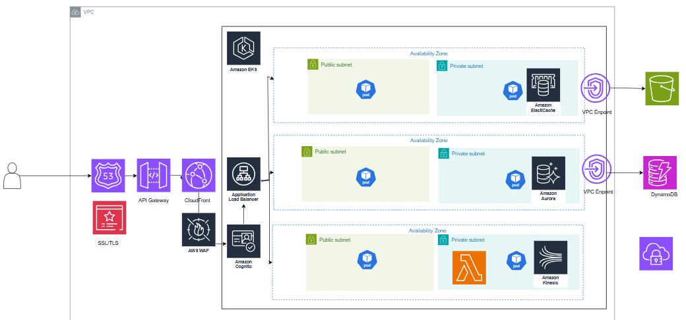

## Overview Diagram

## Components and Technology Choices

### 1. Client & Edge Services
- **Client Devices:**  
  Users access the system through web browsers, mobile apps, or API clients.

- **Amazon CloudFront:**  
  - **Role:** Acts as a CDN to cache and deliver static assets from locations closer to users, reducing latency and load on backend servers.  

- **Amazon API Gateway:**  
  - **Role:** Manages API endpoints, including authentication, throttling, and logging.  

### 2. Load Balancing & Compute
- **Application Load Balancer (ALB):**  
  - **Role:** Distributes incoming traffic evenly across backend instances (containers or EC2) and supports health checks and SSL termination.  

- **Container Services (EKS):**  
  - **Role:** Runs microservices for order management, account handling, risk management, etc., in a containerized environment. This approach simplifies deployments and scales automatically.  

- **Trading Engine on EC2:**  
  - **Role:** Handles high-performance, low-latency order matching. EC2 instances can be tuned to meet strict performance requirements.  

### 3. Data Layer
- **Amazon Aurora:**  
  - **Role:** Stores critical transactional data (e.g., account balances, trade histories) with strong consistency and high availability using Multi-AZ deployments.  

- **Amazon DynamoDB:**  
  - **Role:** Provides a fast NoSQL database for maintaining the order book and other data that require high throughput and low latency.  

- **Amazon ElastiCache (Redis):**  
  - **Role:** Caches frequently accessed data (such as order book snapshots and market data) to reduce the load on primary databases and maintain sub-100ms response times.  

### 4. Messaging & Event Streams
- **Amazon Kinesis / SQS:**  
  - **Role:** Handles asynchronous event processing, real-time data streaming, and audit logs to decouple system components and improve resilience.  

### 5. Monitoring & Logging
- **Amazon CloudWatch:**  
  - **Role:** Monitors system metrics, collects logs, and sets up alerts to proactively manage system health.

## Scalability Plan

To ensure the system can grow and continue to meet performance requirements, the following strategies are in place:

- **Compute Scaling:**  
  - **EC2:** Use Auto Scaling Groups for EC2 instances running the trading engine to automatically add or remove instances based on demand.
  - **Containers:** Leverage ECS/EKS auto scaling to adjust the number of container instances dynamically.

- **Database Scaling:**  
  - **DynamoDB:** Utilize on-demand capacity or auto scaling to handle sudden increases in load.
  - **Aurora:** Implement Multi-AZ deployments and read replicas to distribute read traffic and maintain high availability.
  - **ElastiCache:** Scale the cache cluster horizontally as demand increases.

- **Load Balancing & Traffic Management:**  
  - ALB distributes incoming traffic across healthy instances and ensures no single component is overwhelmed.
  - API Gateway can throttle or burst requests as necessary to protect backend services.

